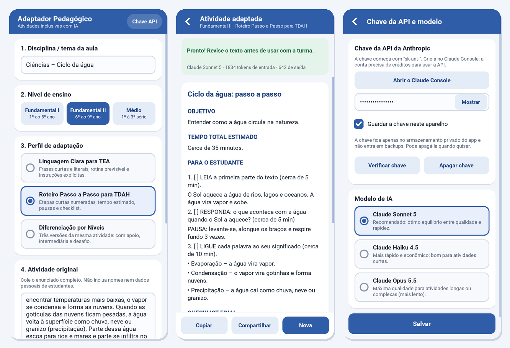

# Adaptador Pedagógico Inclusivo

Aplicação Android para professores adaptarem atividades escolares com Inteligência Artificial, usando o plano **gratuito** da API do **Google Gemini** (não é preciso cartão de crédito). O professor indica o tema, o nível de ensino (Fundamental I, Fundamental II ou Médio) e o perfil de adaptação:

- **Linguagem Clara para TEA**: frases curtas e literais, estrutura previsível, glossário;
- **Roteiro Passo a Passo para TDAH**: etapas curtas com tempo estimado, pausas e checklist;
- **Diferenciação por Níveis**: três versões da mesma atividade (com apoio, intermediária e desafio).

A resposta aparece em tempo real e pode ser copiada ou partilhada (WhatsApp, e-mail, Drive…). Os textos da app estão em português do Brasil, porque os níveis de ensino seguem o sistema brasileiro.



---

## Conteúdo do projeto

```
adaptador-pedagogico/
├── main.py                     ← código da app (Kivy)
├── buildozer.spec              ← configuração da compilação Android
├── .github/workflows/build.yml ← compila o APK no GitHub Actions
├── data/                       ← ícone, ícone adaptativo e ecrã de abertura
│   ├── icon.png  icon_fg.png  icon_bg.png  presplash.png
├── docs/capturas.png           ← imagem deste guia (opcional)
├── .gitignore
└── README.md
```

Versões usadas: Buildozer 1.6.0 · python-for-android 2026.05.09 (fixado por commit) · Python 3.14 no Android · Kivy 2.3.1 · NDK r28c · Java 17 · Android mínimo 5.0 (API 21), alvo API 33 · arquiteturas arm64-v8a e armeabi-v7a.

---

## Passo 1 — Criar o repositório no GitHub

1. Entre em <https://github.com> (crie uma conta gratuita, se não tiver).
2. Clique em **+ → New repository**.
3. Nome: `adaptador-pedagogico`. Escolha **Public** (minutos de Actions ilimitados) ou **Private** (usa a quota mensal gratuita de minutos da sua conta).
4. **Não** marque "Add a README file". Clique em **Create repository**.

## Passo 2 — Enviar os ficheiros

**Pelo navegador (sem instalar nada):**

1. Descompacte o `adaptador-pedagogico.zip` no computador.
2. No repositório, clique em **uploading an existing file** (ou **Add file → Upload files**).
3. Arraste `main.py`, `buildozer.spec`, `README.md` e as pastas **`data`** e **`docs`**. Clique em **Commit changes**.
4. O workflow fica numa pasta oculta (`.github`), que muitas vezes não é enviada ao arrastar. Crie-o à mão: **Add file → Create new file**, escreva no nome `.github/workflows/build.yml` (as barras criam as pastas), cole o conteúdo do ficheiro `build.yml` e clique em **Commit changes**.

**Com Git (alternativa):**

```bash
cd adaptador-pedagogico
git init -b main
git add .
git commit -m "Adaptador Pedagógico Inclusivo"
git remote add origin https://github.com/SEU_UTILIZADOR/adaptador-pedagogico.git
git push -u origin main
```

## Passo 3 — Acompanhar a compilação

1. Abra o separador **Actions** do repositório. Se o GitHub pedir para ativar os workflows, aceite.
2. A execução **Build APK Android** começa sozinha depois do commit (também pode iniciá-la em **Run workflow**).
3. A **primeira** compilação demora **30 a 60 minutos**, porque descarrega o Android SDK/NDK e compila o Python para Android. As seguintes costumam demorar **menos de 15 minutos**, graças à cache.
4. Quando terminar, aparece um visto verde ✅.

## Passo 4 — Descarregar o APK

1. Em **Actions**, abra a execução concluída.
2. Desça até à secção **Artifacts** e clique em `adaptadorpedagogico-1.0.N-arm64-v8a_armeabi-v7a-debug.apk`. O ficheiro `.apk` é descarregado diretamente, sem `.zip`.
3. O artefacto fica disponível durante **30 dias**. É preciso ter sessão iniciada no GitHub para o descarregar; pode fazê-lo diretamente no navegador do telemóvel.

## Passo 5 — Instalar no Android

1. Abra o `.apk` no telemóvel. Se o Android pedir, autorize **Instalar apps desconhecidas** para o navegador ou para o gestor de ficheiros.
2. Se o Play Protect avisar que a app é desconhecida, escolha a opção para instalar mesmo assim: é a sua própria app, assinada com uma chave de depuração.
3. **Atualizações:** cada compilação recebe uma versão maior (`1.0.<n.º da execução>`) e instala-se por cima da anterior, mantendo a chave e o rascunho guardados.

> **Aparelhos no Brasil — a partir de 30/09/2026.** A Google passa a exigir, nos aparelhos Android certificados no Brasil (e na Indonésia, em Singapura e na Tailândia), que as apps instaladas fora da Play Store venham de programadores registados. Para instalar este APK de depuração:
> - **Fluxo avançado:** em *Opções de programador*, ative a opção para permitir apps de programadores não verificados. Há uma espera única de 24 horas; depois disso, a instalação funciona normalmente;
> - **ADB:** a instalação por cabo a partir do computador (`adb install -r ficheiro.apk`) não é afetada;
> - **Registo:** crie uma conta na Android Developer Console. A conta gratuita de distribuição limitada permite partilhar com até 20 aparelhos sem documento de identidade. Para distribuir a mais pessoas, precisa da verificação completa ou da Play Store.
>
> Detalhes: [Android developer verification](https://support.google.com/android-developer-console/answer/16561738).

## Passo 6 — Criar e colocar a chave gratuita do Gemini

1. Abra <https://aistudio.google.com/apikey> e entre com a sua conta Google. A conta tem de ser de uma pessoa com **18 anos ou mais**. Se aparecerem termos de utilização, aceite-os.
2. Clique em **Create API key** (Criar chave de API). Se o site pedir um projeto, aceite o que ele sugerir. Copie a chave: começa por `AIza`. Não é preciso cartão de crédito.
3. Na app, toque em **Chave API**, cole a chave, mantenha **Guardar a chave neste aparelho** e toque em **Verificar chave**. A verificação não gasta pedidos.
4. Deixe o modelo **Gemini 3.8 Flash** e toque em **Salvar**.

**Limites do plano gratuito.** A Google limita os pedidos por minuto e por dia, e muda estes valores com frequência. Em setembro de 2026, havia relatos de cerca de **20 pedidos por dia no Gemini 3.8 Flash** e **500 no Gemini 3.5 Flash-Lite**. Os valores da sua conta aparecem na página [Rate limit do AI Studio](https://aistudio.google.com/rate-limit).
- Cada modelo tem a sua cota diária. Quando a de um acaba, a app passa sozinha para o outro e avisa-o no resultado.
- As cotas diárias renovam-se à meia-noite do horário do Pacífico, ou seja, às **4h ou 5h da manhã em Brasília**.
- Se usar a app muitas vezes por dia, pode escolher o Flash-Lite diretamente em **Chave API**.

**Privacidade no plano gratuito.** A Google pode usar os textos enviados para melhorar os produtos dela, e pessoas podem lê-los para esse fim. **Nunca** cole nomes nem dados pessoais de estudantes.

A chave fica apenas no armazenamento privado da app e não entra em backups (`android.allow_backup = False`). **Nunca** coloque a chave no código nem no GitHub.

---

## Usar a app

1. Escreva a disciplina/tema, escolha o nível e o perfil e cole a atividade (o botão **Exemplo** preenche uma atividade de teste).
2. Toque em **Adaptar atividade**. O texto aparece enquanto é gerado; pode **Cancelar** a qualquer momento.
3. Use **Copiar** ou **Compartilhar**. **Nova** volta ao formulário, que mantém os dados para testar outro perfil.

O formulário é guardado automaticamente. Erros temporários (servidor ocupado, limite por minuto, falha de rede) são repetidos automaticamente até 2 vezes. A app avisa quando não há Internet (permissão `ACCESS_NETWORK_STATE`).

**Testar no computador** (Windows, macOS ou Linux, com Python 3.10 a 3.13, versões para as quais há Kivy 2.3.1 pré-compilado):

```bash
pip install "kivy==2.3.1" requests
export GEMINI_API_KEY="AIza..."           # Windows (PowerShell): $env:GEMINI_API_KEY="AIza..."
python main.py
```

Sem chave digitada na app, é usada a variável de ambiente `GEMINI_API_KEY` (ou `GOOGLE_API_KEY`).

---

## Resolução de problemas

| Sintoma | O que fazer |
|---|---|
| Erro no passo **Verificar ficheiros do projeto** | Falta um ficheiro no repositório (o nome aparece no erro). Envie a pasta `data/` e confirme que o workflow está em `.github/workflows/build.yml`. |
| Falha a descarregar SDK/NDK/Gradle (tempo esgotado, erro 5xx) | Falha temporária da rede. Clique em **Re-run jobs**. |
| Compilação falhou depois de mexer em `requirements` ou em `android.*` | No `build.yml`, altere `CACHE_VERSION: v1` para `v2` (descarta a cache) e volte a compilar. |
| Falha dentro do python-for-android (receitas, `pip`, `gradle`) | Abra o registo do passo **Compilar APK**, procure a primeira linha com `Error` ou `Traceback` e copie as 30 linhas anteriores para diagnóstico. Alternativa: usar o python-for-android em desenvolvimento, com `p4a.branch = develop`, apagar a linha `p4a.commit` e usar `android.minapi = 24` e `android.ndk_api = 24`. |
| "App não instalada" / conflito de pacote | A assinatura mudou. A cache do keystore expira se passarem 7 dias sem compilações. Desinstale a versão anterior ou configure a assinatura permanente (secção seguinte). |
| A app fecha ao abrir | Ligue o telemóvel por USB com a depuração USB ativa e execute `adb logcat -s python` ([Platform-Tools](https://developer.android.com/tools/releases/platform-tools)) para ver o erro. |
| "Chave da API do Gemini inválida" | Copie de novo a chave no [AI Studio](https://aistudio.google.com/apikey) e use **Verificar chave**. A chave certa começa por `AIza`. |
| "Os pedidos gratuitos de hoje no Gemini acabaram" | Os dois modelos gratuitos esgotaram a cota do dia. Tente de novo depois das 5h (horário de Brasília). |
| "Limite de pedidos por minuto do Gemini" | Aguarde um minuto e toque em **Tentar de novo**. |
| "O Gemini não gerou a resposta (filtros…)" | Os filtros da Google bloquearam o texto. Reveja a atividade (retire conteúdo sensível) e tente de novo. |
| "O plano gratuito do Gemini não está disponível para esta conta ou região" | Use uma conta Google de maior de idade, num país onde a Gemini API está disponível (o Brasil está). |
| "O Gemini está sobrecarregado ou indisponível" | Servidores da Google ocupados. Aguarde uns segundos e toque em **Tentar de novo**. |

### Assinatura permanente (opcional)

Por omissão, o keystore de depuração é guardado na cache do GitHub Actions. Para uma assinatura que nunca muda, crie um keystore uma vez (o `keytool` vem com o Java/JDK):

```bash
keytool -genkeypair -v -keystore debug.keystore -storepass android -alias androiddebugkey \
  -keypass android -keyalg RSA -keysize 2048 -validity 10000 -dname "CN=Android Debug,O=Android,C=US"
base64 -w0 debug.keystore > keystore.txt          # macOS: base64 -i debug.keystore -o keystore.txt
```

No Windows (PowerShell): `[Convert]::ToBase64String([IO.File]::ReadAllBytes("debug.keystore")) > keystore.txt`

Depois, em **Settings → Secrets and variables → Actions → New repository secret**, crie `ANDROID_DEBUG_KEYSTORE_B64` com o conteúdo de `keystore.txt`. O workflow passa a usá-lo automaticamente.

---

## Personalizar

- **Nome e ícones:** `title` no `buildozer.spec`; substitua os PNG em `data/` pelos seus, mantendo os nomes e tamanhos (`icon.png` 512×512, `icon_fg.png`/`icon_bg.png` 432×432, `presplash.png` 1024×1024).
- **Compilar mais depressa em testes:** `android.archs = arm64-v8a`.
- **Mudar o ID da app** (`package.domain`/`package.name`): a app nova não substitui a antiga; é preciso desinstalar a anterior.
- **Play Store:** exige `buildozer android release` (AAB assinado com chave própria) e uma API alvo recente (`android.api`). Está fora do âmbito deste APK de depuração.

## Privacidade

O texto da atividade é enviado à Google (Gemini API) para ser processado. No plano gratuito, a Google pode usar esse texto para melhorar os produtos dela, com revisão humana. Não inclua nomes nem dados pessoais de estudantes (LGPD). O conteúdo gerado por IA deve ser sempre revisto pelo professor antes de ser usado com a turma.
